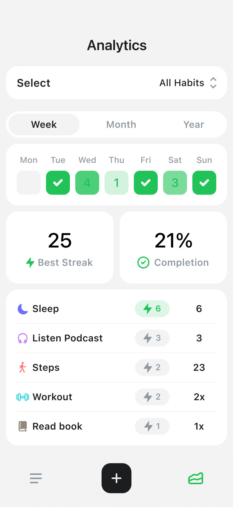
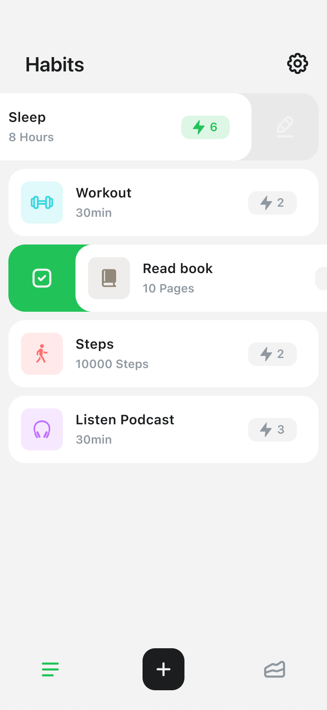

# Habiton

## Beschreibung
**Habiton** ist eine Android-App, die dir hilft, gesunde Gewohnheiten aufzubauen und sie in deinen Alltag zu integrieren. Die App ermöglicht das Tracken von Gewohnheiten, das Setzen von Erinnerungen und das Analysieren deines Fortschritts. Ziel ist es, durch Regelmäßigkeit und Motivation langfristige Verhaltensänderungen zu unterstützen.

## Features
- **Gewohnheiten tracken**: Erstelle und verwalte eine Liste deiner täglichen, wöchentlichen oder monatlichen Gewohnheiten.
- **Erinnerungen**: Erhalte Push-Benachrichtigungen, damit du deine Gewohnheiten nicht vergisst.
- **Analytics**: Analysiere deine Gewohnheiten mit Statistiken und Visualisierungen für Woche, Monat oder Jahr.
- **Progress Tracking**: Verfolge deinen Fortschritt mit Streaks und Abschlussraten.
- **Benutzerfreundliche Oberfläche**: Minimalistisches Design für eine intuitive Nutzung.

## Technologie-Stack
- **Programmiersprache**: Java
- **Plattform**: Android
- **Datenbank**: SQLite
- **Benachrichtigungen**: Android Push Notifications

## Installation
1. **APK-Datei installieren**: Lade die neueste Version der APK von [GitHub Releases](https://github.com/DeinGitHubProfil/Habiton/releases) herunter und installiere sie auf deinem Android-Gerät.
2. **App starten**: Öffne die App und erstelle deine erste Gewohnheit.

## Funktionen im Detail
### 1. Dashboard
Das Dashboard zeigt eine Übersicht deiner aktuellen Gewohnheiten. Du kannst neue Gewohnheiten hinzufügen, bestehende bearbeiten oder löschen.

### 2. Erinnerungen
- Stelle Erinnerungen ein, um Benachrichtigungen zu erhalten.
- Du wirst erinnert, wenn eine Gewohnheit für den Tag noch offen ist.

### 3. Analytics
- Analysiere deinen Fortschritt wöchentlich, monatlich oder jährlich.
- Statistiken zu Best-Streaks und Abschlussraten.
- Übersicht über alle Gewohnheiten und deren Erfüllungsstatus.

## Ausblick
Geplante Features:
- Synchronisation über mehrere Geräte.
- Unterstützung für Widgets auf dem Homescreen.
- Integration mit Kalender-Apps, um Gewohnheiten besser zu planen.

## Lizenz
Dieses Projekt steht unter der MIT-Lizenz. Siehe [LICENSE](LICENSE) für weitere Informationen.
